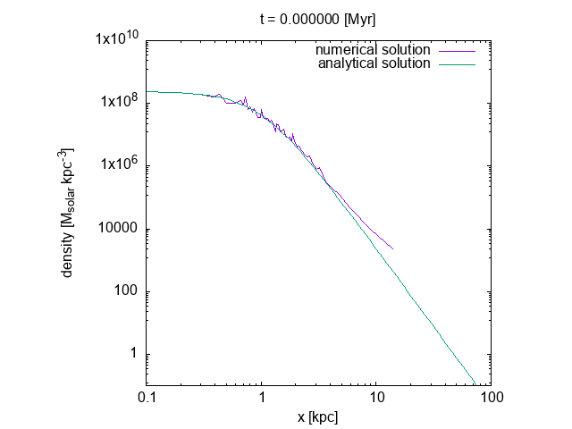

# plummer.c の実行に書き出されるデータセット

## cold_collapse.csv

t  
Rx,Ry,Rz,Vx,Vy,Vz  
.
.
.

## cold_collapse_enegy.csv

t,Ek,Ep,Em,Viral  
.
.
.

## cold_collapse_enegy.csv

t  
rho,|R|
.
.
.

# 各pltファイルを用いてplotした図

# 2d_animation.plt

# enegy.plt

# virial_ratio.plt

# rho_animation.plt

## 備考

t：時間[Myr]  
R：位置座標[kpc]  
V：速度ベクトル[unitを戻していない] 65.589 をかけると [km s-1]になる  
Ek：系全体の運動エネルギー[M_solar kpc^2 Myr^-2]  
Ek：系全体のポテンシャルエネルギー[M_solar kpc^2 Myr^-2]  
Em：系全体の力学的エネルギー[M_solar kpc^2 Myr^-2]  
Viral：系のビリアル比[無次元]
rho：密度[M_solar kpc^-3]